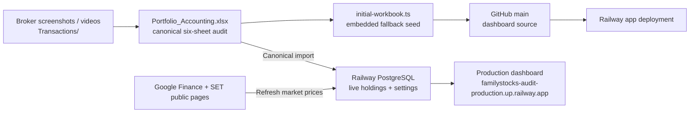

# Stock Audit — Project Operations Guide

> **Purpose:** one practical map of the accounting workbook, GitHub codebase,
> Railway production service, and the steps required to keep them synchronized.
> Latest canonical reconciliation: **19 Sep 2026**. All active assets are Shared;
> contributor capital remains separate and unwithdrawn profits remain pooled.
> Actual deployment/import verification is recorded in the workspace-root
> `Handoff.md` and must be checked against production `/api/portfolio`.

## Start here

The 7 Sep 2026 presentation update replaces the portfolio composition R3F
ring with a responsive SVG donut (maximum 360px, 1:1 aspect ratio). It uses
the same market-value weights and combined ticker quantities. Selection is
available on chart segments and list rows; cash below 0.1% stays selectable
through the list. This change requires only a code deployment, with no
workbook import or market refresh.

| Question | Correct place to look |
|---|---|
| What is the audited accounting record? | `../Portfolio_Accounting.xlsx` |
| What broker evidence supports it? | `../Transactions/` |
| What code is deployed? | This `dashboard/` Git repository, branch `main` |
| Where does the live dashboard read/write? | Railway PostgreSQL, through the production service |
| How do I safely update the live holdings? | Update the canonical workbook, push code/seed if needed, then import the canonical workbook directly |

The accounting workbook is the **canonical audit record**. Railway PostgreSQL
is the **live shared dashboard record after a canonical import**. GitHub
contains the dashboard implementation and its embedded fallback seed; a Git
push alone does not replace the production portfolio database.

## System map



### What each layer owns

| Layer | Owns | Must not be used as |
|---|---|---|
| `Portfolio_Accounting.xlsx` | transactions, cost basis, shareholder capital, historical dividend record, current forecast inputs, accounting totals | A disposable dashboard export |
| `Transactions/` | evidence for new buys, sells, fees, and transfers | A replacement for the reconciled ledger |
| GitHub `main` | UI, server/API logic, tests, README, embedded fallback seed | The live portfolio database |
| Railway PostgreSQL | imported live holdings/settings, persisted quotes, import metadata, Analyzer snapshots | The only historical accounting ledger |
| Dashboard export | a one-sheet four-column transport file | A replacement for the six-sheet audit workbook |

## Current canonical state — 19 Sep 2026

The user confirmed Mom owns both new deposits (THB300,000 and THB20,000).
All stocks, cash and unwithdrawn gains remain Shared. USD/THB 33.254 is an
approved accounting reference, not newly evidenced settlement FX.

| Contributor | Total capital THB | Reference percentage |
|---|---:|---:|
| Mom | 1,870,000.00 | 51.449868% |
| Rattee | 1,464,606.003945636 | 40.296142% |
| Ryu | 300,000.00 | 8.253990% |
| Total | 3,634,606.003945636 | 100% |

Active Shared holdings: ASML 6, QQQI 1,190, GOOGL 30, VOO 11, KLAC 53,
FN 13, AMAT 10.4, CRWV 50 and CASH THB4,805.78937. SPCX, AVGO, META and
INTC are closed. Ten new ledger records from 17–19 Sep bring the total to
125; all 108 prior rows remain unchanged. New realized P&L is
THB24,621.4212006001 and cumulative realized P&L is THB581,591.075320574.
No profit distribution or withdrawal is recorded.

Exchange entries are not another cash flow. The THB-only screenshot balance
does not establish total broker cash. At carried audit marks: value
THB3,852,539.967814, unrealized P&L THB59,402.1452470688, total P&L
THB640,993.220567643. Historical April dividends remain unchanged;
US forecast assumptions are still explicitly unconfigured.

ASML, KLAC, AMAT and CRWV use Google Finance NASDAQ/USD, while FN uses
Google Finance NYSE/USD. The four new mappings are part of the shared quote
persistence allow-list. The support is deployed in GitHub `main` commit
`1c7ed81` after the accounting commits `924ec64` and `1330ba6`. The canonical
workbook was imported into Railway PostgreSQL at
`2026-09-20T09:43:06.334Z` UTC with content hash
`48d2f3f9b815853618cd63d6a9101ed7b85a0b29a596817745648f4c033a1873`.
The subsequent production market refresh at `2026-09-20T09:51:10.711Z` UTC
completed with no failures and persisted KLAC, FN, AMAT and CRWV quotes. Verify
all six tabs and unchanged CASH after future refreshes.

## Historical canonical state — 9 Sep 2026

User-confirmed policy: all current assets, cash and unwithdrawn income belong
to Shared. Record each person's contributed capital separately. Owner equity,
sale-P&L share and dividend-share figures are illustrative at current capital
percentages; they do not record a withdrawal or an agreed profit payment.
Keep all historical transaction-owner notes and the April dividend history.

| Contributor | Total capital THB | Reference percentage |
|---|---:|---:|
| Mom | 1,550,000.00 | 46.762722% |
| Rattee | 1,464,606.003945636 | 44.186428% |
| Ryu | 300,000.00 | 9.050849% |
| Total | 3,314,606.003945636 | 100% |

| Active Shared asset | Units / balance |
|---|---:|
| QQQI | 1,190 |
| GOOGL | 43 |
| AVGO | 6.9162 |
| SPCX | 67 |
| VOO | 18.60 |
| CASH | THB640.64247 |

The 20 Aug Rattee THB10,000 deposit was already included. Add only the
missing 25 Aug THB5,000 deposit, then the 25 Aug INTC one-share buy and
9 Sep INTC nine-share sale, GOOGL three-share buy, META twenty-share sale,
and VOO 18.60-share buy. META and INTC are closed in active holdings but
remain in the ledger. There are 108 parsed transactions.

New sale gains are THB5,355.22416 (INTC) and THB44,774.51576 (META), total
THB50,129.73992. Cumulative realized P&L is THB562,899.5073999737. Broker
totals control cash/cost; VOO's USD2.106 implied fees/rounding difference is
not a verified fee breakdown. USD/THB 33.254 is explicitly approved as a
carried accounting reference, not actual settlement FX. Cash remains a
roll-forward rather than a newly confirmed broker cash snapshot.

At carried audit marks, value is THB3,487,962.691553695, unrealized P&L
THB-32,179.57548163811 and total P&L THB530,719.9319183356. Live quotes
will differ after refresh; quantities, costs, capital and realized P&L must not.
The configured Thai-bank forecast is zero, not a complete portfolio forecast.
Current US tickers are excluded until verified DPS/withholding inputs exist;
the UI explicitly flags that gap instead of implying no dividends exist.

Current UI verification also checks fractional units, reference-FX precision,
same-day execution ordering and each mobile card's bounding box. Grid panels
use `min-width: 0` so wide holdings/dividend tables scroll inside the card
rather than extending beyond the viewport.

## Historical canonical state — 24 Aug Rattee overlays and pooled assets

From **5 Aug 2026**, pooled holdings and cash use the total-capital allocation.
Explicitly confirmed owner-specific active overlays are tracked in the same
portfolio proof and added in full to the named owner's current equity.
Historic owner/unit records remain in the ledger for traceability.

| Shareholder | Total contributed capital | Allocation |
|---|---:|---:|
| Mom | THB1,550,000.00 | 46.8334% |
| Rattee | THB1,459,606.00 | 44.1021% |
| Ryu | THB300,000.00 | 9.0645% |
| **Total** | **THB3,309,606.00** | **100.0000%** |

| Active pooled holding | Units / value | Saved 20 Aug audit basis |
|---|---:|---:|
| QQQI | 1,190 | imported audit mark THB1,835.6208 |
| GOOGL | 40 | imported audit mark THB11,390.82516 |
| META | 20 | imported audit mark THB19,384.75422 |
| AVGO | 6.9162 | imported audit mark THB12,960.7465 |
| SPCX | 65 pooled + 2 Rattee overlay | pooled USD140.00; overlay USD132.79 × approved FX 33.254 |
| INTC | 8 Rattee overlay | USD86.14 × approved FX 33.254 |
| CASH | THB1,257.24 | pooled broker cash after Rattee-funded SPCX buy, no quote request |

`Transactions/SPCX_2026-08-19_buy.jpg` records Mom's SPCX buy of 65 @ USD140.00
with a USD9,105.56 broker total and THB299,999.83 settlement. The follow-up
`Transactions/IMG_3380.PNG` records Rattee's INTC buy of 8 @ USD86.14,
USD691.25 broker total, funded by a QQQI dividend. The receipt amount/date is
not separately evidenced, so no dividend receipt row is fabricated. The
approved 33.254 reference gives THB22,986.83 cost. `IMG_3381.PNG` provides
cash-management context. The 20 Aug SPCX 2-share row is a Rattee overlay,
while the original 65-share pooled lot remains unchanged. Full workbook
totals at the saved audit mark are market value THB3,450,177.44, pooled shared
value THB3,418,429.85, unrealized P&L -THB14,835.09, cumulative realized P&L
THB512,769.77 and total P&L THB497,934.68. QQQI and SPCX distributions remain
excluded from the Thai-bank forecast until verified dividend assumptions are
added.

## Live synchronization verified — 25 Aug 2026

GitHub `main` contains the workbook/INTC support commit `c9690ca` and UI
follow-ups `b7ee0d2` and `30327c6`. Railway imported the canonical workbook at
`2026-08-25T09:33:42.659Z` UTC with content hash
`0d9ac007405facea141fd056b9fb14e6ba1a915cebd43860a3d5a64ec29b6968` and
8 active rows. The public refresh completed 13 configured quote keys without
failures at `2026-08-25T09:34:07.925Z` UTC. SPCX refreshed at USD135.00,
INTC at USD87.26, QQQI at USD53.84, and USD/THB at 32.745. Live full portfolio
value was THB3,321,493.36, pooled shared value THB3,289,793.58, personal
overlay value THB31,699.78, and total P&L THB369,250.60.

Production API and all six visible dashboard tabs were verified: Overview,
Shareholders, Holdings, Dividends, Transactions, and Realized Sale P&L.
Shareholders adds the full owner-specific overlay value to Rattee; Holdings
shows SPCX 65 pooled, SPCX 2 Rattee, and INTC 8 Rattee; Transactions shows
the 24 Aug INTC buy newest-first.

## Historical live synchronization verified — 21 Aug 2026

GitHub `main` commit `6adf501` contains the regenerated canonical workbook
seed and updated expectations. Railway imported `Portfolio_Accounting.xlsx`
at `2026-08-20T18:01:11.224Z` UTC with content hash
`cc76d747f66ec98e413f1adc0c646b25c465008f0f34d643c32789092fb06d36`.
The subsequent public refresh completed all 12 configured quote keys without
failures at `2026-08-20T18:01:26.146Z` UTC. SPCX refreshed at USD132.30 and
USD/THB at 32.8565; live market value was THB3,291,276.27 and total P&L was
THB362,020.33. These are display values, not replacements for fixed audit
costs or transaction records.

Production API and the six visible dashboard tabs were checked after import:
Overview, Shareholders, Holdings, Dividends, Transactions, and Realized Sale
P&L. The API reports SPCX 67, CASH THB1,257.24, total capital
THB3,309,606.00, and the 20 Aug SPCX transaction as the newest trade.

## Superseded pre-pooling state — through 4 Aug 2026, retained for traceability

The canonical `Portfolio_Accounting.xlsx` and embedded seed include the owner
corrections, the available broker-history reconciliation, completed broker
orders through **4 Aug 2026**, including three zero-cash ownership allocations,
one completed Mom AAPL sale and two completed Mom META buys. A public market
refresh may replace the saved
audit marks after canonical import, but must not change units or cost basis.

| Holding | Owner/account | Units | Entry price / audit value |
|---|---|---:|---:|
| GOOGL | Mom | 5 | THB57,628.52 cost (USD1,717.67 / five-share allocation) |
| GOOGL | Rattee | 70 | THB851,302.33 cost (65 prior shares + five-share allocation) |
| META | Mom | 20 | THB376,731.64 cost; latest saved mark USD582.92 × 33.254 |
| META | Rattee | 30 | THB552,250.99 cost (USD16,460.34) |
| AAPL | Mom | 6 | THB60,999.16 cost; saved mark USD306.00 × 33.254 |
| AAPL | Ryu | 14 | THB142,331.36 inherited cost; same saved mark |
| MU | Mom | 13 | THB350,645.77 inherited cost; saved mark THB351,781.43 |
| MU | Ryu | 1 | THB26,972.75 inherited cost; saved mark THB27,060.11 |
| NVDA | Mom | 27 | THB185,766.42 inherited cost; saved mark THB185,838.65 |
| NVDA | Ryu | 18 | THB123,844.28 inherited cost; saved mark THB123,892.43 |
| KBANK | Shared | 630 | THB181.804905 average cost; saved mark THB242.00 |
| CASH | Shared | 1 | THB93,086.66 derived from the confirmed snapshot and exact 4 Aug broker cash flow |

Shared capital remains THB2,155,932.19: Mom 57.9796%, Rattee 28.1053%, and
Ryu 13.9151%. SCB has zero active shares after the 27 Jul 2026 sale. The
THB93,086.66 current free-cash bucket is allocated one third to each owner for
current-equity reporting; KBANK and dividend allocation retain the original
pool percentages. The
canonical total market value is THB2,947,921.44, unrealized P&L is
THB11,824.46, realized P&L is THB366,841.04, and total P&L is
THB378,665.51.

The 3 Aug Mom orders are AAPL buy 50 / sell 15, MU buys 10 @ USD812.00 and
10 @ USD809.80 / sell 6, and NVDA buy 35 plus buy 10. They use the
user-approved USD/THB reference 33.254 and leave AAPL 35, MU 14, and NVDA 45.
Time-bounded formulas record AAPL realized P&L of -THB808.77 and MU realized
P&L of +THB444.67; no future buy is included in a sold cost. The later 4 Aug
internal allocation moves AAPL 14, MU 1 and NVDA 18 from Mom to Ryu at
inherited THB cost **THB293,148.40**. It is not a broker trade, cash flow, new
capital or realized P&L event.

The later 4 Aug completed Mom trades are AAPL sell 15 @ USD306.00 and META
buys 4 @ USD582.92 plus 4 @ USD583.40. Broker totals include fees. At the
same-day approved FX 33.254, net cash outflow is THB2,723.84; AAPL realized
P&L is +THB59.16 and current positions become AAPL Mom 6 and META Mom 20.

### Accounting treatment and live-state gap

Treat the earlier 65-share GOOGL ownership correction as a current-position
correction until a dated internal-transfer record and FX / settlement evidence
are available. Do not invent a Mom sale or realized P&L for that earlier
transfer. The dated U.S. buys reduce Shared CASH after the confirmed SCB gain
removal, but are **not** new external personal capital. GOOGL, META, AAPL, MU,
and NVDA are personal positions and must never change shared-capital
percentages, KBANK ownership, or the dividend forecast.

The 3 Aug seven-order net cash flow is THB1,043,421.73. It would leave a
ledger residual of THB109,163.10, whereas the user-confirmed actual broker
cash snapshot was THB95,810.50 before the later 4 Aug orders. Rolling that
snapshot forward gives THB93,086.66. The THB13,352.60 pre-existing difference is intentionally
an unresolved reconciliation item: do not turn it into profit, new capital,
an owner allocation, or a synthetic transaction without broker evidence.

The pre-pooling production evidence above is historical only. On **8 Aug
2026**, commit `cc02b15` was deployed, `Portfolio_Accounting.xlsx` was
imported into Railway, and `/api/portfolio` verified the 7 Aug canonical state:
one active CASH row at THB3,082,130.2945, 87 parsed ledger rows and cumulative
realized P&L THB512,874.3623946404. The post-import refresh correctly reported
no market mapping because CASH has no quote source. Overview, Shareholders,
Holdings, Dividends, Transactions and Realized Sale P&L were each verified.
Repeat that complete import, public-market refresh, API check and all-six-tab
verification after every future accounting update.

## Canonical Excel workbook

Path: `../Portfolio_Accounting.xlsx`

The workbook must keep exactly these six sheets:

1. `Summary` — formula-driven market value, unrealized/realized P&L and totals.
2. `Shareholders` — total contributed capital and pooled allocation
   percentages, with historical personal-capital metadata retained for audit.
3. `Lot Holdings` — active lots and retained historical lots.
4. `Dividends` — historical paid dividend and the current-capital forecast.
5. `Holdings` — current pooled positions, including pooled `CASH`.
6. `Transactions` — full audit ledger and evidence notes.

### Accounting rules that protect the audit

- `CASH` is a pooled THB row: `Units = 1`, and entry price equals the
  confirmed whole-portfolio broker cash snapshot. It has no quote or dividend
  eligibility, and is not a synthetic balancing transaction.
- SCB is a historical zero-quantity holding after the 27 Jul 2026 sale; retain
  its lots and sell rows for traceability.
- From 5 Aug 2026, every active holding and the aggregate CASH row use one
  Total Contributed Capital allocation: Mom 42.3785%, Rattee 47.4506%, Ryu
  10.1708%. Do not re-create personal active positions unless the user changes
  this policy explicitly.
- The current dividend forecast uses total contributed capital as its yield
  denominator. Past shareholder allocation remains historical evidence only.
- A sale's realized P&L must use only purchase cost existing before that sale.
  Never use a whole-ledger average that includes future buys, and never hide a
  missing historical cost basis with `IFERROR`.
- Start every factual accounting change from broker evidence. Create a dated
  backup before editing the canonical workbook.

## Dashboard repository and GitHub

- Repository directory: `dashboard/`
- GitHub remote: `https://github.com/FantasticRattee/FamilyStocks-Audit.git`
- Deployment branch: `main`

Important source files:

| Responsibility | Location |
|---|---|
| Dashboard UI | `app/dashboard/Dashboard.tsx` |
| Workbook parsing/calculation | `app/dashboard/model.ts` |
| Canonical/shared import contract | `app/dashboard/shared-portfolio.ts` |
| PostgreSQL persistence | `app/dashboard/postgres-portfolio-repository.ts` |
| Import route | `app/dashboard/portfolio-api.ts` |
| Public market refresh | `app/dashboard/market-api.ts`, `app/dashboard/live-market.ts` |
| Server runtime adapter | `worker/index.ts` |
| Embedded fallback workbook | `app/dashboard/initial-workbook.ts` |
| Change-impact map | `DEPENDENCIES.md` |

Use `git log -1 --oneline` and the Railway Deployment view to identify the
exact active source revision. Do not paste database URLs, passwords, or API
keys into Git, Excel, documentation, screenshots, or chat exports.

## Railway production

Production dashboard: <https://familystocks-audit-production.up.railway.app/>

Railway runs the dashboard service and PostgreSQL. It needs server-only
variables such as:

```text
DATABASE_URL=${{Postgres.DATABASE_URL}}
TIINGO_API_KEY=<only needed for a new Analyzer refresh>
FMP_API_KEY=<optional; current Forward P/E only>
```

Never document the values. Change a Railway variable through the Railway UI
and redeploy; do not place it in source control.

### Production API responsibilities

| Endpoint | Purpose |
|---|---|
| `GET /api/portfolio` | Load current holdings, settings, stored quotes and import metadata. |
| `POST /api/portfolio/import` | Passwordless, transactional import of canonical audit or minimal holdings workbook. |
| `GET /api/market/refresh` | Refresh QQQI/GOOGL/WDC/META/AAPL/NVDA/MU/AVGO/SPCX/INTC/VOO/ASML/KLAC/FN/AMAT/CRWV/USDTHB from Google Finance and SCB/KBANK from SET public pages. |
| `/api/analyzer*` | Separate U.S.-stock historical-analysis surface; never changes portfolio accounting. |

`Refresh market prices` changes valuation only. It never changes units, entry
price, shareholder capital, transactions, or cost basis. The public sources can
be delayed; if a source fails, the last persisted quote is retained.

## Standard operating runbook

### A. Reconcile a real broker change

1. Save the broker evidence under `../Transactions/` with a meaningful name.
2. Copy `Portfolio_Accounting.xlsx` to a dated backup before editing.
3. Update `Transactions` first. Then update only the dependent sheets that the
   transaction changes: `Lot Holdings`, `Holdings`, `Summary`, `Shareholders`,
   and/or `Dividends`.
4. Recalculate and reconcile quantity, native price, FX, fees, cost basis,
   realized P&L, and the shareholder totals. Do not use current market price
   as a historical cost, or future purchases when calculating an earlier sale.
5. Confirm the six-sheet contract remains intact and scan key formulas for
   errors.
6. Regenerate `app/dashboard/initial-workbook.ts` whenever canonical workbook
   data or layout changes.

### B. Verify and version the dashboard

From `dashboard/`:

```bash
npm run sync:initial-workbook
npm run typecheck
npm run lint
npm test
git status --short
git add <intended files>
git commit -m "<intentional change summary>"
git push origin main
```

Before every push, scan staged content for secrets and local machine paths.
GitHub `main` is the deployment source, but a successful build does not itself
update the shared portfolio rows in PostgreSQL.

### C. Apply the audit to production

1. Wait for the Railway deployment triggered by the GitHub push to become
   active.
2. Import the **canonical six-sheet** `Portfolio_Accounting.xlsx` for a full
   audit/settings replacement. Use the one-sheet minimal format only when the
   intent is explicitly holdings-only.
3. Confirm the import metadata, audit date, owner/account, ticker, units, and
   cash value are correct.
4. Click `Refresh market prices` after the import. Confirm every active
   market-priced ticker has a source link/timestamp (GOOGL, META, AAPL, NVDA,
   MU, SPCX, and INTC use Google Finance; SCB and KBANK use SET); CASH is retained at its
   imported amount.
5. Verify `/api/portfolio` and the visible dashboard agree. Check a second
   device/browser if the goal is to confirm shared persistence.

### D. Recover from a bad import

1. Do not edit the database manually first.
2. Re-import the last known-good canonical workbook (or a dated backup).
3. Verify the import metadata and holdings through `/api/portfolio`.
4. Re-run market refresh only after the correct canonical holdings are live.
5. Preserve the bad file and evidence for audit traceability rather than
   silently overwriting it.

## Import/export rules

The passwordless importer accepts one of two formats:

| Format | Use it for | Effect |
|---|---|---|
| Canonical audit workbook | Accounting updates | Replaces holdings **and** audit settings atomically. |
| Minimal one-sheet `Holdings` workbook | Deliberate holdings-only transport | Replaces current holdings but retains portfolio settings. |

The minimal sheet must contain exactly these columns, in order:

```text
Ticker | Owner/Account | Entry Price | Units
```

Supported owners are `Shared`, `Mom`, `Rattee`, and `Ryu`. Supported active
tickers are `QQQI`, `GOOGL`, `WDC`, `META`, `AAPL`, `NVDA`, `MU`, `AVGO`, `SPCX`,
`INTC`, `VOO`, `ASML`, `SCB`, `KBANK`, and `CASH`;
`CASH` is only valid for `Shared`. A canonical workbook may retain other
tickers in its historical `Transactions` ledger, but they must not become
active holdings unless active ticker support is deliberately added. Dashboard
exports are intentionally minimal and must not replace the canonical accounting
workbook.

## Common pitfalls

- **Git push succeeded but dashboard numbers did not change:** code deployed,
  but the canonical workbook was not imported into Railway PostgreSQL.
- **Import says “exactly one sheet named Holdings”:** a minimal import was
  selected but a six-sheet canonical workbook was expected, or vice versa.
- **Import rejects a supported ticker:** production code is stale; deploy the
  current supported-ticker code before retrying.
- **Market price looks old:** market refresh is manual and public sources can
  be delayed; refresh and inspect source links before changing cost basis.
- **An active position is split by historic owner units:** stop. Since 5 Aug
  2026, active assets use total-contributed-capital percentages; historic owner
  notes exist only for audit traceability.
- **A total profit does not reconcile with one sale:** separate sale proceeds,
  sold cost basis, remaining assets (for example KBANK), pre-existing cash,
  and historical realized P&L before allocating anyone's share.
- **An older sale P&L changes after a new buy:** stop and repair the historical
  cost formula. A sale must not include future buys in its cost basis.

## Documentation map

| Document | Use it for |
|---|---|
| `README.md` | App behavior, local development, API and Railway configuration. |
| `DEPENDENCIES.md` | Code-level change impact and test checklist. |
| `docs/PROJECT_OPERATIONS.md` | This end-to-end operator guide. |
| `../Handoff.md` | Latest audited accounting state and continuation notes. |
| `../DEPENDENCIES.md` | Cross-artifact sync checklist for workbook, GitHub and Railway. |
| `docs/specs/` | Historical/approved design decisions; use the newest applicable spec. |
