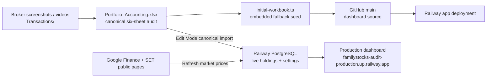

# Stock Audit — Project Operations Guide

> **Purpose:** one practical map of the accounting workbook, GitHub codebase,
> Railway production service, and the steps required to keep them synchronized.
> Last verified: **29 Jul 2026**.

## Start here

| Question | Correct place to look |
|---|---|
| What is the audited accounting record? | `../Portfolio_Accounting.xlsx` |
| What broker evidence supports it? | `../Transactions/` |
| What code is deployed? | This `dashboard/` Git repository, branch `main` |
| Where does the live dashboard read/write? | Railway PostgreSQL, through the production service |
| How do I safely update the live holdings? | Update the canonical workbook, push code/seed if needed, then import the canonical workbook in Edit Mode |

The accounting workbook is the **canonical audit record**. Railway PostgreSQL
is the **live shared dashboard record after an authenticated import**. GitHub
contains the dashboard implementation and its embedded fallback seed; a Git
push alone does not replace the production portfolio database.

## System map



### What each layer owns

| Layer | Owns | Must not be used as |
|---|---|---|
| `Portfolio_Accounting.xlsx` | transactions, cost basis, shareholder capital, historical dividend record, current forecast inputs, accounting totals | A disposable dashboard export |
| `Transactions/` | evidence for new buys, sells, fees, and transfers | A replacement for the reconciled ledger |
| GitHub `main` | UI, server/API logic, tests, README, embedded fallback seed | The live portfolio database |
| Railway PostgreSQL | imported live holdings/settings, persisted quotes, import metadata, Analyzer snapshots | The only historical accounting ledger |
| Dashboard export | a one-sheet four-column transport file | A replacement for the six-sheet audit workbook |

## Current verified state — before the pending GOOGL correction

The last canonical import into production was `Portfolio_Accounting.xlsx` with
four active holdings and an audit date of **29 Jul 2026**:

| Holding | Owner/account | Units | Entry price / audit value |
|---|---|---:|---:|
| GOOGL | Mom | 33 | USD 361.008897 (production import value) |
| GOOGL | Rattee | 31 | USD 355.371834 (production import value) |
| KBANK | Shared | 630 | THB 181.804905 |
| CASH | Shared | 1 | THB 2,321,088.00 |

Shared capital remains THB 2,155,932.19: Mom 57.9796%, Rattee 28.1053%, and
Ryu 13.9151%. SCB has zero active shares after the 27 Jul 2026 sale. The
latest SCB sale proceeds and realized P&L remain historical ledger data;
neither should be removed when changing the current holdings.

### Pending, explicitly not yet applied

The user has instructed the target personal position to become **Rattee: 65
GOOGL units at USD 361.61 average entry price; Mom: 0 GOOGL units**. This has
not yet been written to Excel, GitHub, Railway, or PostgreSQL.

Treat it as a current-position correction until a dated internal-transfer
record and FX / settlement evidence are available. Do not invent a Mom sale or
realized P&L in the transaction ledger. Personal GOOGL must never change the
shared-capital percentages, shared cash, KBANK ownership, or dividend forecast.

## Canonical Excel workbook

Path: `../Portfolio_Accounting.xlsx`

The workbook must keep exactly these six sheets:

1. `Summary` — formula-driven market value, unrealized/realized P&L and totals.
2. `Shareholders` — shared contributed capital, ownership percentages and
   personal positions.
3. `Lot Holdings` — active lots and retained historical lots.
4. `Dividends` — historical paid dividend and the current-capital forecast.
5. `Holdings` — current active positions, including Shared `CASH`.
6. `Transactions` — full audit ledger and evidence notes.

### Accounting rules that protect the audit

- `CASH` is a Shared-only THB row: `Units = 1`, and entry price equals the
  full THB account balance. It has no quote or dividend eligibility.
- SCB is a historical zero-quantity holding after the 27 Jul 2026 sale; retain
  its lots and sell rows for traceability.
- Shared capital percentages allocate shared cash and KBANK. Personal GOOGL
  belongs to its named owner only and does not dilute the dividend forecast.
- The current dividend forecast uses shareholder shared capital as its yield
  denominator; it does not use shared cash or market value.
- Start every factual accounting change from broker evidence. Create a dated
  backup before editing the canonical workbook.

## Dashboard repository and GitHub

- Repository directory: `dashboard/`
- GitHub remote: `https://github.com/FantasticRattee/FamilyStocks-Audit.git`
- Deployment branch: `main`

Important source files:

| Responsibility | Location |
|---|---|
| Dashboard UI | `app/dashboard/Dashboard.tsx` |
| Workbook parsing/calculation | `app/dashboard/model.ts` |
| Canonical/shared import contract | `app/dashboard/shared-portfolio.ts` |
| PostgreSQL persistence | `app/dashboard/postgres-portfolio-repository.ts` |
| Import/auth routes | `app/dashboard/portfolio-api.ts`, `app/dashboard/edit-auth.ts` |
| Public market refresh | `app/dashboard/market-api.ts`, `app/dashboard/live-market.ts` |
| Server runtime adapter | `worker/index.ts` |
| Embedded fallback workbook | `app/dashboard/initial-workbook.ts` |
| Change-impact map | `DEPENDENCIES.md` |

Use `git log -1 --oneline` and the Railway Deployment view to identify the
exact active source revision. Do not paste database URLs, passwords, or API
keys into Git, Excel, documentation, screenshots, or chat exports.

## Railway production

Production dashboard: <https://familystocks-audit-production.up.railway.app/>

Railway runs the dashboard service and PostgreSQL. It needs server-only
variables such as:

```text
DATABASE_URL=${{Postgres.DATABASE_URL}}
EDIT_MODE_PASSWORD=<secret>
TIINGO_API_KEY=<only needed for a new Analyzer refresh>
FMP_API_KEY=<optional; current Forward P/E only>
```

Never document the values. Change a Railway variable through the Railway UI
and redeploy; do not place it in source control.

### Production API responsibilities

| Endpoint | Purpose |
|---|---|
| `GET /api/portfolio` | Load current holdings, settings, stored quotes and import metadata. |
| `POST /api/portfolio/import` | Authenticated, transactional import of canonical audit or minimal holdings workbook. |
| `GET /api/market/refresh` | Refresh GOOGL/USDTHB from Google Finance and SCB/KBANK from SET public pages. |
| `POST /api/edit-auth` | Validate Edit Mode password without creating a browser session. |
| `/api/analyzer*` | Separate U.S.-stock historical-analysis surface; never changes portfolio accounting. |

`Refresh market prices` changes valuation only. It never changes units, entry
price, shareholder capital, transactions, or cost basis. The public sources can
be delayed; if a source fails, the last persisted quote is retained.

## Standard operating runbook

### A. Reconcile a real broker change

1. Save the broker evidence under `../Transactions/` with a meaningful name.
2. Copy `Portfolio_Accounting.xlsx` to a dated backup before editing.
3. Update `Transactions` first. Then update only the dependent sheets that the
   transaction changes: `Lot Holdings`, `Holdings`, `Summary`, `Shareholders`,
   and/or `Dividends`.
4. Recalculate and reconcile quantity, native price, FX, fees, cost basis,
   realized P&L, and the shareholder totals. Do not use current market price
   as a historical cost.
5. Confirm the six-sheet contract remains intact and scan key formulas for
   errors.
6. Regenerate `app/dashboard/initial-workbook.ts` whenever canonical workbook
   data or layout changes.

### B. Verify and version the dashboard

From `dashboard/`:

```bash
npm run typecheck
npm run lint
npm test
git status --short
git add <intended files>
git commit -m "<intentional change summary>"
git push origin main
```

Before every push, scan staged content for secrets and local machine paths.
GitHub `main` is the deployment source, but a successful build does not itself
update the shared portfolio rows in PostgreSQL.

### C. Apply the audit to production

1. Wait for the Railway deployment triggered by the GitHub push to become
   active.
2. Open the production dashboard and enter Edit Mode with the server-side
   password.
3. Import the **canonical six-sheet** `Portfolio_Accounting.xlsx` for a full
   audit/settings replacement. Use the one-sheet minimal format only when the
   intent is explicitly holdings-only.
4. Confirm the import metadata, audit date, owner/account, ticker, units, and
   cash value are correct.
5. Click `Refresh market prices` after the import. Confirm GOOGL, USDTHB, SCB
   and KBANK source links/timestamps appear; CASH is retained at its imported
   amount.
6. Verify `/api/portfolio` and the visible dashboard agree. Check a second
   device/browser if the goal is to confirm shared persistence.

### D. Recover from a bad import

1. Do not edit the database manually first.
2. Re-import the last known-good canonical workbook (or a dated backup).
3. Verify the import metadata and holdings through `/api/portfolio`.
4. Re-run market refresh only after the correct canonical holdings are live.
5. Preserve the bad file and evidence for audit traceability rather than
   silently overwriting it.

## Import/export rules

The authenticated importer accepts one of two formats:

| Format | Use it for | Effect |
|---|---|---|
| Canonical audit workbook | Accounting updates | Replaces holdings **and** audit settings atomically. |
| Minimal one-sheet `Holdings` workbook | Deliberate holdings-only transport | Replaces current holdings but retains portfolio settings. |

The minimal sheet must contain exactly these columns, in order:

```text
Ticker | Owner/Account | Entry Price | Units
```

Supported owners are `Shared`, `Mom`, `Rattee`, and `Ryu`. Supported active
tickers are `GOOGL`, `SCB`, `KBANK`, and `CASH`; `CASH` is only valid for
`Shared`. Dashboard exports are intentionally minimal and must not replace the
canonical accounting workbook.

## Common pitfalls

- **Git push succeeded but dashboard numbers did not change:** code deployed,
  but the canonical workbook was not imported into Railway PostgreSQL.
- **Import says “exactly one sheet named Holdings”:** a minimal import was
  selected but a six-sheet canonical workbook was expected, or vice versa.
- **Import rejects `CASH`:** production code is stale; deploy the current
  supported-ticker code before retrying.
- **Market price looks old:** market refresh is manual and public sources can
  be delayed; refresh and inspect source links before changing cost basis.
- **A personal position changes pool numbers:** stop. Personal positions must
  not affect shared ownership or dividend allocation.
- **A total profit does not reconcile with one sale:** separate sale proceeds,
  sold cost basis, remaining assets (for example KBANK), pre-existing cash,
  and historical realized P&L before allocating anyone's share.

## Documentation map

| Document | Use it for |
|---|---|
| `README.md` | App behavior, local development, API and Railway configuration. |
| `DEPENDENCIES.md` | Code-level change impact and test checklist. |
| `docs/PROJECT_OPERATIONS.md` | This end-to-end operator guide. |
| `../Handoff.md` | Latest audited accounting state and continuation notes. |
| `../DEPENDENCIES.md` | Cross-artifact sync checklist for workbook, GitHub and Railway. |
| `docs/specs/` | Historical/approved design decisions; use the newest applicable spec. |
